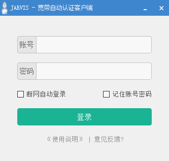
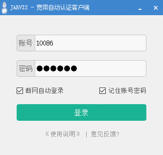
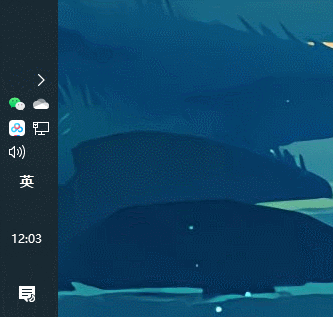

# JARVIS

**JARVIS** 专门针对深圳大学网络时常断网情况而设计，是一个只会耍点小聪明的系统。当然啦，如果您觉得这个小东西对您有帮助，别忘了帮忙点一颗:star:小星星:star:

## 下载安装

抱歉，目前仅仅制作windows平台的安装程序（其他平台正在马不停蹄地制作中），安装方式如下：

- 最新版安装包，[点击下载](https://github.com/szuboy/JARVIS/releases/download/v1.0/JARVIS_installer.exe)
- 不同版本选择，[点击查看](https://github.com/szuboy/JARVIS/releases)

## 使用指南

（1）双击打开软件，输入账号密码登录，可选择勾选 “断网自动登录” 和 “记住账号密码”：

（2）点击 “登录” 按钮，即将进行账号密码的校验，将会有右下角登录成功动画 或者 账号密码错误弹窗：

  

（3）登录成功后，JARVIS将自动隐藏在系统托盘中：

## 意见反馈

使用过程中出现错误或者有充斥着不好的用户体验，作者是一个完美主义者，还请您花几分钟分享你的体验经历和问题反馈，他一定会一一回复。

## 功能开发

- [x] 登录成功提示
- [x] 隐藏系统托盘
- [x] 断网自动登录（2分钟检测一次是否联网）
- [x] 记住账号密码

